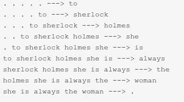

# ES-335-Assignment-3-2024-Fall

### Team Name - Bias Busters
Team Members:
1. [Shardul Junagade](https://github.com/ShardulJunagade)
2. [Soham Gaonkar](https://github.com/Soham-Gaonkar)
3. [Umang Shikarvar](https://github.com/Umang-Shikarvar)
4. [Sharvari Mirge](https://github.com/msharvari31)

This repository contains the code for the assignment 3 of the course ES 335: Machine Learning Fall-2024 at IIT Gandhinagar taught by Prof. Nipun Batra.


## Next-Word Prediction

1. Refer to the [notebook](https://nipunbatra.github.io/ml-teaching/notebooks/names.html) on generating names using next-character prediction and modify it for generating text using **next-word prediction**. You have to implement an MLP-based text generator. However, it is recommended to refer to Andrej Karpathy’s blog post on the [Effectiveness of RNNs](http://karpathy.github.io/2015/05/21/rnn-effectiveness/) and his [notebook](https://github.com/karpathy/char-rnn) for additional insights.

2. Visualize the embeddings using t-SNE if using more than 2 dimensions or using a scatter plot if using 2 dimensions and write your observations. 

3. Write a [streamlit](https://streamlit.io/) application that asks users for an input text, and it then predicts the next **k** words or lines. In the streamlit app, you should have controls for modifying context length, embedding dimension, activation function, random seed, etc. You can use any one of the datasets mentioned below.


**Hints:**

1. For text-based datasets, you can remove special characters except “full stop (.)” so that it can be used to split sentences. However, you cannot ignore special characters for other datasets like for C++ code. You will have to treat text between newlines as a statement. To remove special characters from a line, you can use the following code snippet:
    ```py
    import re
    line = re.sub('[^a-zA-Z0-9 \.]', '', line)
    ```
   It will remove everything except alphanumeric characters, space and full-stop.

    

2. Convert the text to lowercase and use unique words to create the vocabulary.  
3. To create X, and y pairs for training, you can use a similar approach used for next-character prediction. For example:

    

   You will get something like *“. . . . . \---\> to”* whenever there is a paragraph change. 

4. You may have to use a larger embedding size for words. (For example: 32 or 64\)  
5. Use a similar model as used for next-character prediction. Here, you may have to increase the size of hidden layers. (For example, 1024).  
6. For the streamlit app, no need to re-train the model based on the user input. Train two to three variants and accordingly give options to the user.  
7. For visualizations, you may have to select words with relations like synonyms, antonyms, names and pronouns, verb and adverbs, words with no relations, and so on.  
8. Think how you would handle the case where words provided by the user in streamlit are not in the vocabulary.  
9. Use Google Colab or Kaggle for training (use maximum 500-1000 epochs). Start the assignment early, as training takes time. 

**Datasets:**

- Paul Graham essays
- [Wikipedia](http://prize.hutter1.net/) (English)
- [Shakespeare](https://cs.stanford.edu/people/karpathy/char-rnn/shakespeare_input.txt)
- [Leo Tolstoy's War and Peace](https://cs.stanford.edu/people/karpathy/char-rnn/warpeace_input.txt)
- [The Adventures of Sherlock Holmes, by Arthur Conan Doyle](https://www.gutenberg.org/files/1661/1661-0.txt)
- [Maths textbook](https://github.com/stacks/stacks-project)
- Python or C++ code ([Linux Kernel Code](https://cs.stanford.edu/people/karpathy/char-rnn/linux_input.txt))
- IITGN advisory generation
- IITGN website generation
- Generate sklearn docs
- Notes generation
- Image generation (ascii art, 0-255)
- Music Generation
- Something comparable in spirit but of your choice (do confirm with TA Anupam)


